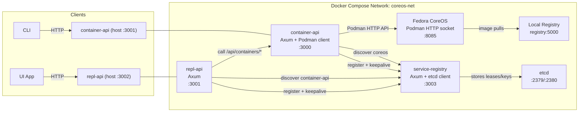
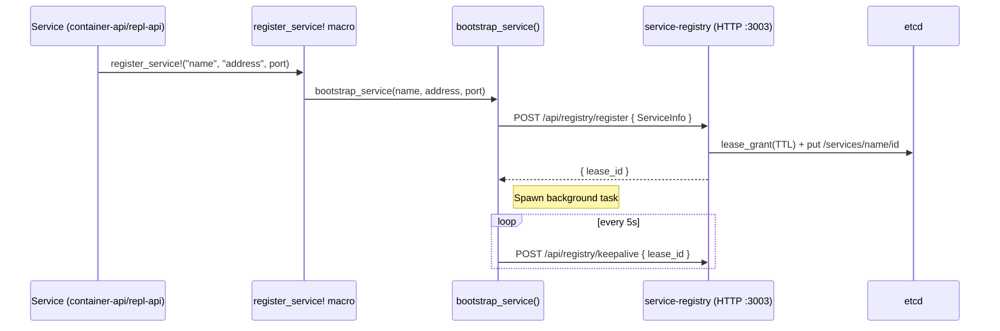
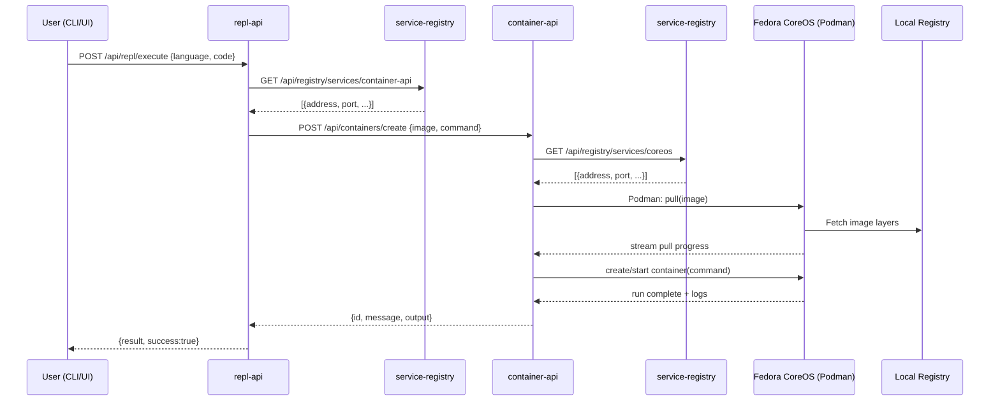
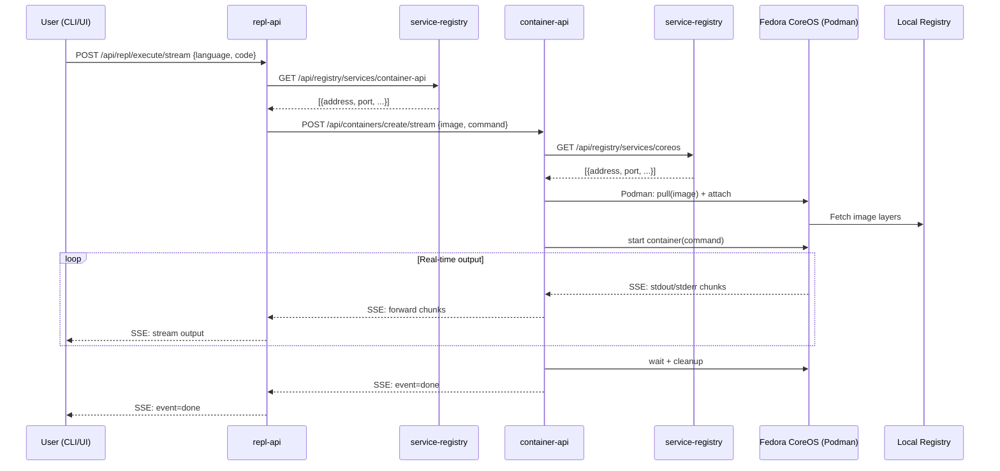
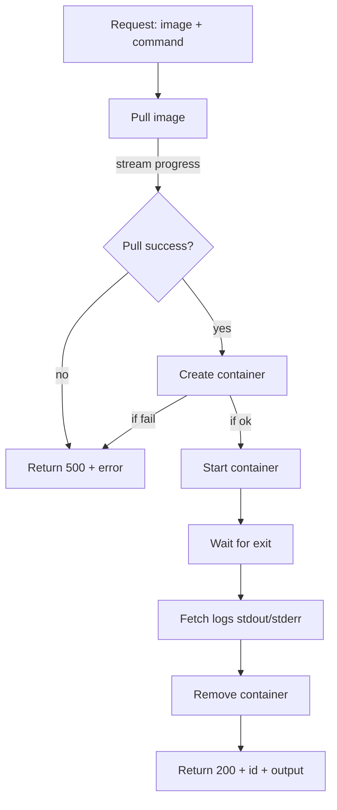
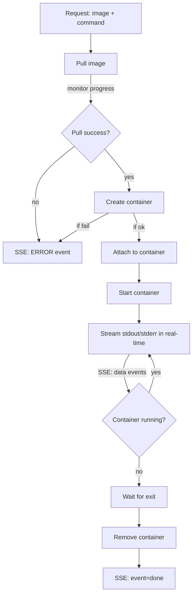
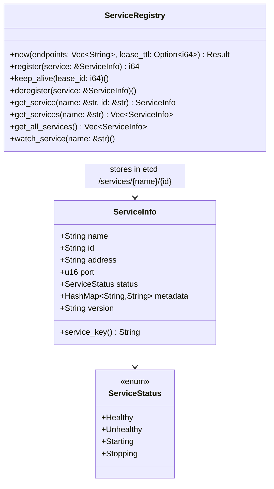
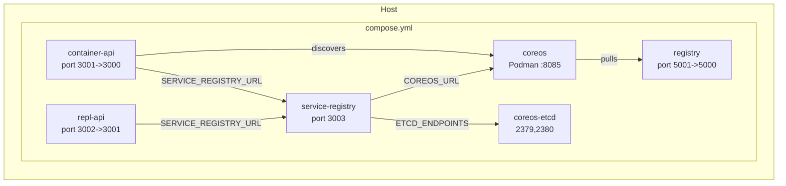

# xxx Architecture and System Diagrams

This document explains how the project’s services fit together and how requests flow through the system.

## Overview

- Purpose: Provide a simple REPL-as-a-service backed by ephemeral containers run via Podman on a Fedora CoreOS host.
- Key pieces:
  - `service-registry`: HTTP service that stores service registrations in etcd and provides discovery + lease keepalives.
  - `container-api`: HTTP service that pulls images, runs containers, captures output, and cleans up.
  - `repl-api`: HTTP service that turns user code into container runs via `container-api`.
  - `coreos`: Fedora CoreOS container exposing Podman’s remote HTTP API (socket on `:8085`).
  - `coreos-etcd`: etcd backend for `service-registry`.
  - `registry`: Local Docker registry for faster, local image pulls.
  - `cli` and `ui`: Clients that call the APIs.

## High-Level Architecture

Notes:
- `service-registry` persists service instances in etcd under keys `/services/{name}/{id}` with a TTL lease. Clients keep leases alive via `/api/registry/keepalive`.
- `container-api` and `repl-api` auto-register on startup using the `register_service!` macro which delegates to `bootstrap_service`.
- `repl-api` discovers `container-api` dynamically; `container-api` discovers the Podman endpoint (`coreos`) dynamically. Both fall back to env vars when service discovery is unavailable.

## Service Registration Flow

- Auto-registration can also occur in `service-registry` for `coreos` when `COREOS_URL` is set (extracts host/port and registers).

## REPL Execution Flow

### Standard (Non-Streaming) Execution

### Streaming Execution (SSE)

The CLI and other clients now use streaming by default for real-time output:

Streaming features:
- Uses Server-Sent Events (SSE) for real-time output delivery
- Container output is streamed as it's generated (no buffering)
- Errors are prefixed with `ERROR:` in the stream
- Stream ends with `event:done` when container execution completes
- Automatic cleanup after container finishes

Error handling:
- If discovery fails, services fall back to env vars (`CONTAINERS_API_URL`, `COREOS_URL`).
- Pull or run errors are propagated back to callers with `500` and explanatory messages.
- For streaming endpoints, errors are sent as SSE events prefixed with `ERROR:`

## Container Lifecycle (container-api)

### Standard (Non-Streaming) Flow

### Streaming Flow (SSE)

## Service Registry Data Model

## Deployment View (docker compose)

- Network: All services join `coreos-net` for intra-service communication.
- Ports: Host-to-container mappings provide local access for development/testing.

## API Endpoints

- `service-registry`:
  - `POST /api/registry/register` → `{ lease_id }`
  - `POST /api/registry/keepalive` → `200 OK`
  - `POST /api/registry/deregister` → `200 OK`
  - `GET /api/registry/services` → `ServiceInfo[]`
  - `GET /api/registry/services/{name}` → `ServiceInfo[]`
- `container-api`:
  - `GET  /api/containers/list` → `string[][]`
  - `POST /api/containers/create` → `{ id, message, output? }`
  - `POST /api/containers/create/stream` → SSE stream (real-time output)
  - `DELETE /api/containers/{id}` → `{ id, message }`
- `repl-api`:
  - `GET  /api/repl/languages` → `{ languages: string[] }`
  - `POST /api/repl/execute` → `{ result, success }`
  - `POST /api/repl/execute/stream` → SSE stream (real-time output)

## Configuration

- `SERVICE_REGISTRY_URL`: Base URL for service-registry (default `http://service-registry:3003`).
- `ETCD_ENDPOINTS`: Comma-separated etcd endpoints for service-registry.
- `COREOS_URL`: Base URL for Podman on CoreOS (default `http://coreos:8085`).
- `CONTAINERS_API_URL`: Base URL used by `repl-api` when discovery is unavailable.

## How Things Fit Together

- Services register themselves and keep leases alive, enabling lightweight discovery and health indication.
- `repl-api` converts language + code into an image + command, then delegates execution to `container-api`.
- `container-api` pulls the requested image and executes the command on CoreOS’s Podman, streams results, and performs cleanup.
- etcd + leases ensure that stale service entries expire automatically if a service dies.